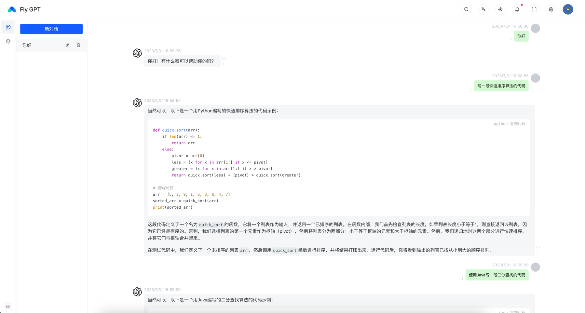

# Fly-AI

## 介绍
FlyAI 目标是建立一个LLMOps平台，基于不同的大型语言模型能力，让更多人可以简易地创建可持续运营的原生 AI 应用。FlyAI 目标是提供多种类型应用的可视化编排，应用可开箱即用，也能以“后端即服务”的 API 提供服务。

通过 FlyAI 创建的应用将会包含：

- 开箱即用的的 Web 站点，支持表单模式和聊天对话模式
- 一套 API 即可包含插件、上下文增强等能力，替你省下了后端代码的编写工作
- 可视化的对应用进行数据分析，查阅日志或进行标注

也是参考业内领先的LLMOps平台[Dify.ai](https://github.com/langgenius/dify.git)进行开发，dify是基于Python语言，本工程将使用Java语言来实现，拓展Java在LLM领域的应用案例。

## 核心能力

1. 模型支持，用户可以在 FlyAI 上选择基于不同模型的能力来开发你的 AI 应用。FlyAI 兼容 Langchain，将逐步支持多种 LLMs ，目前集成的模型供应商：
- [x] **OpenAI**：GPT4、GPT3.5-turbo、GPT3.5-turbo-16k、text-davinci-003
- [ ] **Azure OpenAI Service**
- [ ] **Anthropic**：Claude2、Claude-instant
- [ ] **Replicate**
- [ ] **Hugging Face Hub**
- [ ] **ChatGLM**
- [ ] **Llama2**
- [ ] **MiniMax**
- [ ] **讯飞星火大模型**
- [ ] **文心一言**
- [ ] **通义千问**

2. 可视化编排 Prompt： 通过界面化编写 prompt 并调试，只需几分钟即可发布一个 AI 应用。
3. 文本 Embedding 处理（数据集）：全自动完成文本预处理，使用你的数据作为上下文，无需理解晦涩的概念和技术处理。支持 PDF、txt 等文件格式，支持从 Notion、网页、API 同步数据。
4. 基于 API 开发： 后端即服务。您可以直接访问网页应用，也可以接入 API 集成到您的应用中，无需关注复杂的后端架构和部署过程。
5. 团队 Workspace： 团队成员可加入 Workspace 编辑、管理和使用团队内的 AI 应用。
6. 数据标注与改进： 可视化查阅 AI 应用日志并对数据进行改进标注，观测 AI 的推理过程，不断提高其性能。（Coming soon）
# 框架

- Spring Boot 2.7.13
- JDK 17
- Postgresql 15
- MyBatis Plus
- Lombok

## 技术要点

### 上下文聊天

通过 Postgresql 实现聊天数据存储来实现上下文聊天，已实现流式输出结果，可以通过配置参数 maxTokens 来限制上下问问题的数量。

数据库存储了每次聊天对话的记录，在选择上下文聊天时，通过 chatId 获取历史消息，将历史问题以及回答消息都发送给 GPT。

## 知识库问答

### 知识库分词
已实现按照句子分词、段落分词、固定长度分词等分词方式，并通过ChatGPT进行Embedding

### 知识库匹配
通过Postgresql 插件 PGvector进行相似度匹配，获取与问题比较匹配的知识点

### 知识库问答
通过对问题进行Embedding，然后匹配知识库，构建Prompt，发送给ChatGPT获取答案。

## 私有部署问题

可导入知识库文件、文本对知识库进行构建，知识库存储在本地数据库，调用ChatGPT接口进行问答，简而言之，数据还是会给到ChatGPT，但是不是所有的数据都给过去，理论上是一个半私有或者部分私有部署的状态，如果要实现完全私有化则需要部署一套私有的大语言模型。

## 后续计划
目前项目继续更多的小伙伴的加入，诚挚邀请后端、前端、UI、测试小伙伴一起参与项目。
后续实现功能：
- 增加类似增加类似与ChatPDF的功能与ChatPDF的功能
- 增加AI应用功能
- 集成其他大语言模型

## 项目交流

## LICENSE
[MIT](LICENSE)

前端部分基于

[Chagpt-Web](https://github.com/Chanzhaoyu/chatgpt-web)